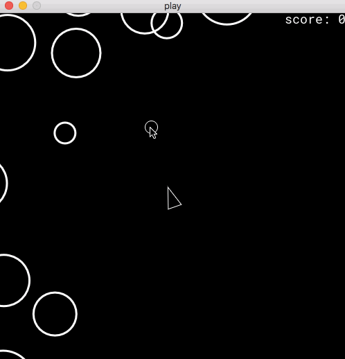

```
 __
(_  _  _ __  o  _ 
__)(_ (/_| | | (_ 
   _____            __                       __     ___
  /  _  \   _______/  |_  ___________  ____ |__| __| _/______
 /  /_\  \ /  ___/\   __\/ __ \_  __ \/  _ \|  |/ __ |/  ___/
/    |    \\___ \  |  | \  ___/|  | \(  <_> )  / /_/ |\___ \ 
\____|__  /____  > |__|  \___  >__|   \____/|__\____ /____  >
        \/     \/            \/                     \/    \/ 
```

# Scenic Asteroids



This is an Asteroids clone written in Elixir with Nerves, more for fun and
learning than for anything else. Also since the code (and behavior) is
relatively simple, I hope that it can serve as an example for Scenic, Nerves,
and as a simple [poncho
project](https://embedded-elixir.com/post/2017-05-19-poncho-projects/).

It is licensed under the 3-clause BSD license (see LICENSE) for details.

## Instructions

From the root of the repository run the following commands:
* Install [scenic pre-requisites](https://github.com/boydm/scenic_new#install-prerequisites)
* `cd play_ui`
* `mix deps.get`
* `iex -S mix`

Keys:
* `W` - Move up
* `A` - Move left
* `S` - Move down
* `D` - Move right
* `SPC` - Shoot an asteroid

Use the mouse to target the asteroids (or your finger if you're running with a
Nerves touch screen)

Have fun!

## Implementation Notes

[SchedEx](https://github.com/SchedEx/SchedEx) is used to implement the core
animation timer which runs at a rate of 60 frames per second.

Collision detection is incredibly basic and non-performant. Ideally either
scenic or a cooperating library would implement some collision detector helpers.
If you're interested in collision detection then please contribute to Scenic
[issue #91](https://github.com/boydm/scenic/issues/91).

# Projects

* `play/` - The main game logic
* `play_ui/` - Run via scenic on the desktop
* `fw/` - Run on a Nerves device with a touchscreen
  * Official Raspberry PI touch screen is supported

TODO:
* [x] Get basic nerves install working on network
* [x] Run scenic play application on nerves!

mix archive.install hex nerves_bootstrap
mix archive.install hex nerves_bootstrap
mix archive.install hex nerves_bootstrap

00:00:35.048 [error] GenServer #PID<0.18620.0> terminating
** (MatchError) no match of right hand side value: {:error, :enoent}                                                                 
    (play) lib/scenes/splash.ex:63: Play.Scene.Splash.init/2
    (scenic) lib/scenic/scene.ex:611: Scenic.Scene.handle_cast/2
    (stdlib) gen_server.erl:637: :gen_server.try_dispatch/4
    (stdlib) gen_server.erl:711: :gen_server.handle_msg/6
    (stdlib) proc_lib.erl:249: :proc_lib.init_p_do_apply/3
Last message: {:"$gen_cast", {:after_init, Play.Scene.Splash, Play.Scene.Asteroids, [scene_ref: #Reference<0.2407746728.805306372.131064>, parent: nil, vp_dynamic_root: #PID<0.18613.0>, viewport: #PID<0.18613.0>, styles: %{}]}}                                        
State: %{activation: :__not_activated__, children: %{}, dyn_scene_keys: %{}, dyn_scene_pids: %{}, dynamic_children_pid: nil, parent_pid: nil, raw_scene_refs: %{}, scene_module: Play.Scene.Splash, scene_ref: #Reference<0.2407746728.805306372.131064>, supervisor_pid: nil, viewport: #PID<0.18613.0>}
